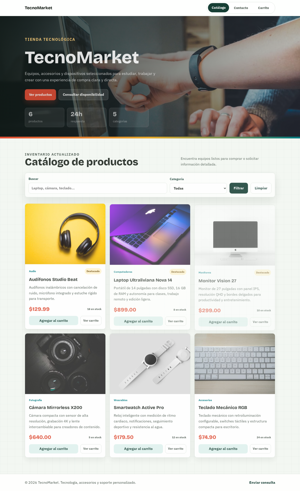
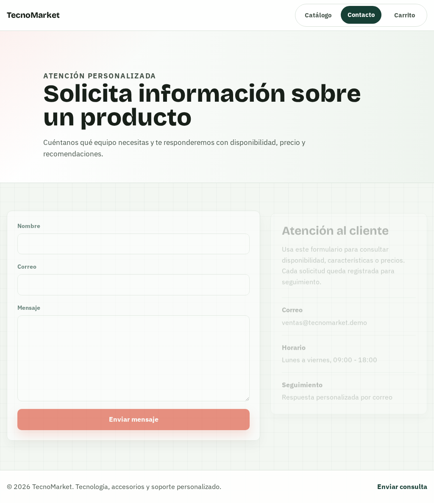
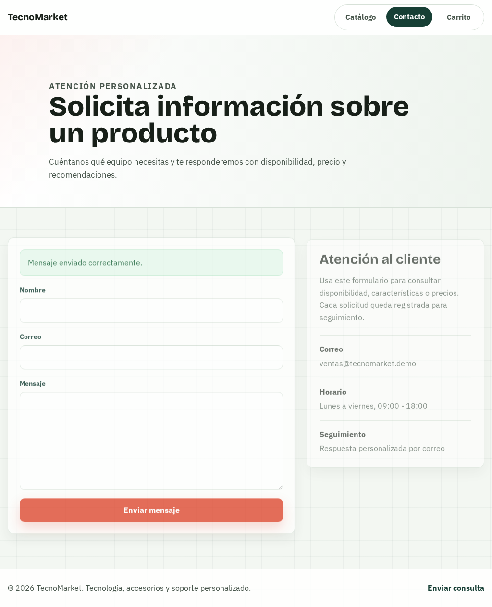

# TecnoMarket

Sistema web para una tienda de productos tecnológicos. Permite mostrar un catálogo dinámico cargado desde MySQL, registrar consultas de clientes y preparar pedidos por WhatsApp desde un carrito de compras.

## Estructura

- `index.php`: catálogo dinámico con búsqueda y filtro por categoría.
- `contacto.php`: formulario con validación en cliente y servidor.
- `checkout.php`: carrito, resumen de compra y envío del pedido por WhatsApp.
- `config/database.php`: conexión MySQL basada en variables de entorno o archivo `.env`.
- `includes/`: cabecera, pie de página y funciones auxiliares.
- `assets/css/styles.css`: estilos del sitio.
- `assets/js/cart.js`: lógica del carrito, cantidades, total y mensaje de WhatsApp.
- `database/schema.sql`: creación de tablas y productos de ejemplo.

## Instalación local en XAMPP

1. Copiar la carpeta del sistema dentro de `htdocs`.
2. Iniciar Apache y MySQL desde XAMPP.
3. Crear una base de datos llamada `tecnomarket`.
4. Seleccionar esa base de datos en phpMyAdmin e importar `database/schema.sql`.
5. Crear un archivo `.env` si necesitas usar credenciales distintas a las locales:

```env
DB_HOST=127.0.0.1
DB_PORT=3306
DB_NAME=tecnomarket
DB_USER=root
DB_PASS=
DB_CHARSET=utf8mb4
```

6. Abrir el sistema en el navegador:

```text
http://localhost/nombre-de-la-carpeta/
```

## Uso

- En el catálogo se pueden buscar productos por nombre o descripción.
- El filtro de categoría se carga desde los datos existentes en MySQL.
- Cada producto disponible se puede agregar al carrito.
- El carrito se guarda en el navegador mediante `localStorage`.
- En checkout se calculan cantidades y total estimado.
- Al enviar el pedido se abre WhatsApp con el detalle listo para enviar al número configurado.
- El formulario de contacto valida nombre, correo y mensaje antes de guardar el registro en la tabla `contactos`.

## WhatsApp de pedidos

El número de destino está configurado en `assets/js/cart.js`:

```js
const WHATSAPP_NUMBER = '593983987321';
```

## Evidencias

Las capturas del sistema se guardan en la carpeta `evidencias`.

### Sitio y catálogo

Página principal con hero, filtros y productos cargados desde la base de datos.



### Formulario de contacto

Vista del formulario para solicitudes de clientes.



### Formulario enviado

Confirmación visible después de enviar el formulario de contacto.



Capturas de phpMyAdmin por guardar en `evidencias/`:

- `01-base-datos-estructura.png`: estructura de la base `sistema-inventario-dinamico`.
- `03-tabla-productos.png`: registros de la tabla `productos`.
- `06-tabla-contactos.png`: registros de la tabla `contactos`.

## Despliegue en Docker/Dokploy

El contenedor no incluye MySQL. La aplicación se conecta a una base remota usando variables de entorno.

1. Crear una base de datos MySQL remota.
2. Importar `database/schema.sql`.
3. Crear o configurar el usuario MySQL con permisos sobre la base.
4. En Dokploy, definir las variables de `.env.example`.
5. Configurar el proxy/dominio hacia el puerto interno `80`.

Ejemplo de variables:

```env
APP_PORT=9005

DB_HOST=host.docker.internal
DB_PORT=3306
DB_NAME=tecnomarket
DB_USER=tecnomarket_user
DB_PASS=clave_segura_del_usuario
DB_DATABASE=tecnomarket
DB_USERNAME=tecnomarket_user
DB_PASSWORD=clave_segura_del_usuario
DB_CHARSET=utf8mb4
```

Si MySQL está en otro servidor, reemplaza `DB_HOST` por el host o IP real. Si MySQL está en el mismo servidor que Docker/Dokploy, puedes probar con `host.docker.internal`.

El sistema acepta ambos formatos de variables:

- `DB_NAME`, `DB_USER`, `DB_PASS`
- `DB_DATABASE`, `DB_USERNAME`, `DB_PASSWORD`

```bash
docker compose up -d --build
```

Dentro del contenedor Apache escucha en el puerto `80`. En Dokploy configura el servicio para enrutar hacia el puerto interno `80`.

## Despliegue en Dokploy

1. Crear una aplicación de tipo Docker Compose.
2. Usar `docker-compose.yml` como archivo Compose.
3. Definir las variables de `.env.example` en el panel de variables de entorno.
4. Configurar el dominio o proxy de Dokploy apuntando al puerto interno `80` del servicio.
5. Verificar que el servicio esté conectado a la red externa `dokploy-network`.
6. Verificar que la base MySQL remota permita conexiones desde el servidor donde corre Dokploy.
7. Desplegar la aplicación.

No agregues un servicio MySQL al Compose; este sistema está preparado para conectarse a una base externa mediante variables de entorno.

## Despliegue manual en servidor

1. Crear una base de datos MySQL en el servidor.
2. Importar `database/schema.sql` desde el panel del proveedor.
3. Subir todos los archivos del sistema al directorio público del servidor.
4. Configurar `DB_HOST`, `DB_PORT`, `DB_NAME`, `DB_USER` y `DB_PASS` en el entorno del servidor.

URL de producción: `minipos.elvismacas.com`
